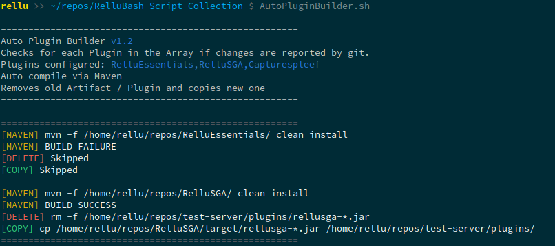
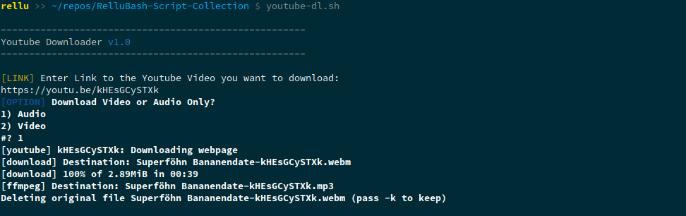

Collection of Bash Scripts and other goodies i use.

## Scripts:

- AutoPluginBuilder.sh (exec mvn, deletes old artifact and copies new one in target folder)
  
- youtube-dl.sh (Prompts you to enter url and if audio only)
  
- ConfigureFedora.sh (does some configuration on a clean install)

## Other:

- .bashrc